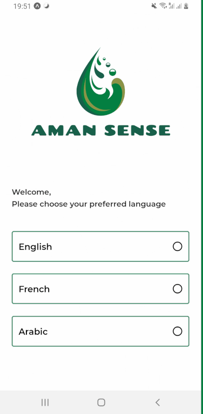
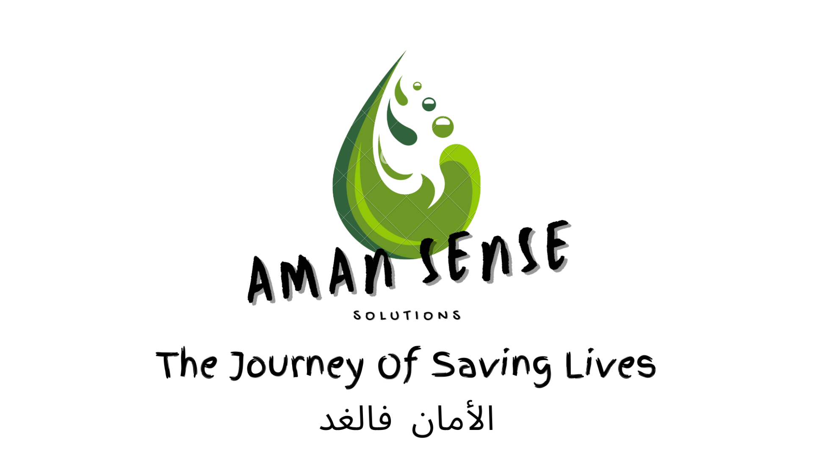
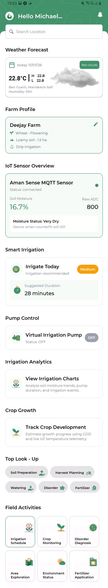
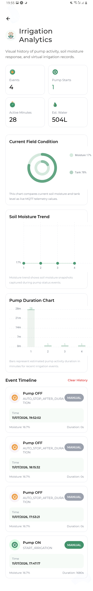
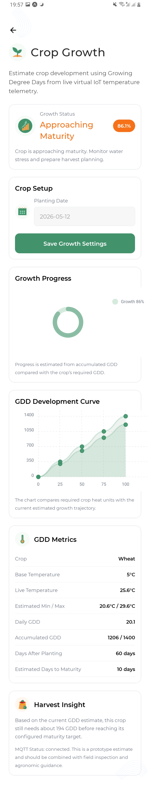
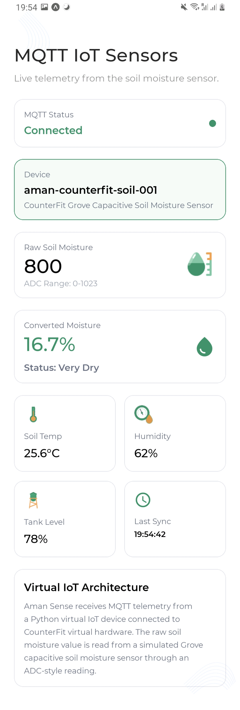
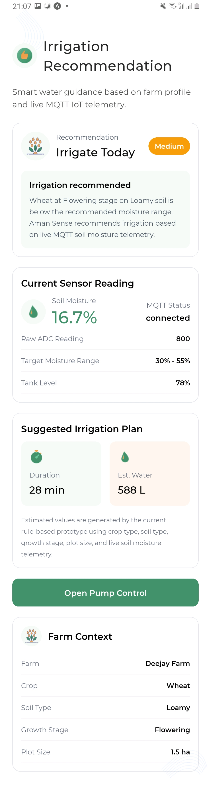
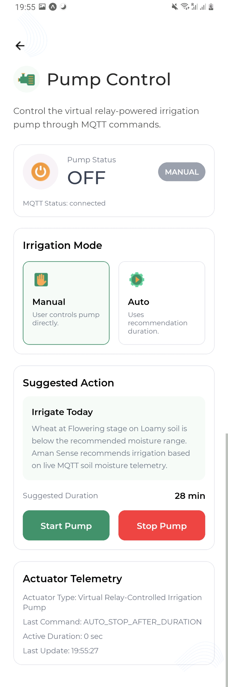

# Aman Sense Solutions

## IoT-Enabled Smart Irrigation and Crop Monitoring Decision-Support App

**Innovation & Entrepreneurship Course Project | Master’s in Agribusiness Innovation**  
**African Business School, Mohammed VI Polytechnic University (UM6P)**




Aman Sense Solutions is an entrepreneurship and technical solution that connects agribusiness innovation with digital agriculture. It demonstrates how IoT telemetry, mobile decision support, irrigation automation, and analytics can support water-efficient farming.

---

## Project Overview

Aman Sense Solutions is an IoT-enabled smart irrigation and crop-monitoring app designed to support data-driven water management for farmers operating under water scarcity conditions.

The system combines:

- Microsoft CounterFit virtual IoT hardware simulation
- Python-based virtual IoT device logic
- MQTT telemetry and command communication
- React Native mobile application
- Farm profile management
- Rule-based irrigation recommendation engine
- Virtual pump and relay control
- Irrigation event history and analytics charts
- Crop-growth estimation using Growing Degree Days, GDD

The solution demonstrates a complete **sensor-to-decision-to-actuator feedback loop** for digital agriculture.

```text
Soil Sensor → MQTT Telemetry → Mobile Decision Engine → Pump Command → Actuator Feedback → Analytics
```

---

## Project Context

Aman Sense Solutions was developed as an entrepreneurship and innovation project within the **Master’s in Agribusiness Innovation at African Business School, Mohammed VI Polytechnic University (UM6P)**.

The project responds to a major agribusiness challenge: improving agricultural water-use efficiency in water-stressed farming environments. The prototype demonstrates how IoT sensing, MQTT telemetry, mobile decision support, and irrigation automation can support more efficient water management for farmers.

This repository focuses on the implemented technical prototype.

---

## Problem Statement: Water Scarcity in Moroccan Agriculture

Water scarcity is a major challenge for agriculture in Morocco. The project research frames Morocco as one of the highly water-stressed countries, with limited irrigated agricultural land and strong pressure on available water resources.

Only a portion of Morocco’s agricultural land is irrigated, while much of the remaining land depends on rain-fed production. At the same time, irrigated agriculture consumes a large share of available water resources. This creates a need to maximize water-use efficiency and ensure that water demand does not exceed water supply.

The problem is also intensified by pressure on groundwater resources, including illegal wells and borehole drilling. For farmers in arid regions such as Marrakech, irrigation decisions are often made using fixed schedules, experience, visual inspection, or incomplete weather information.

These approaches can lead to:

- over-irrigation;
- under-irrigation;
- water waste;
- increased energy and production costs;
- soil saturation;
- crop stress;
- lower water productivity.

Aman Sense addresses this problem by providing a smart water monitoring and irrigation decision-support solutions that uses soil moisture telemetry, farm profile data, crop-specific logic, pump control, and analytics to support actionable irrigation decisions.

---


## Field Discovery Context 

As part of the agribusiness innovation process, Aman Sense included field discovery with farmers to understand irrigation challenges, water-use constraints, and the need for practical digital agriculture tools.

<p align="center">
  <a href="assets/demo/farmer-field-discovery.mp4">
    
  </a>
  <br>
  <a href="assets/demo/farmer-field-discovery.mp4">Watch the field discovery clip</a>
</p>

---

## Entrepreneurial Motivation

The mission of Aman Sense is to empower farmers with insights that help optimize irrigation, reduce water wastage, and improve agricultural and water productivity.

The app is built around a simple idea: farmers do not only need raw sensor data; farmers need clear mobile recommendations and practical irrigation guidance.

Aman Sense translates field and farm data into:

- current soil moisture status;
- irrigation recommendations;
- suggested pump duration;
- pump status feedback;
- irrigation history and analytics;
- crop-growth progress.

---

## Target Users

The primary target users are farmers operating in water-stressed agricultural environments, especially farmers using drip irrigation systems or sprinklers in arid and semi-arid regions.

The app is designed to help farmers:

- monitor soil moisture;
- know whether irrigation is needed;
- receive crop-specific recommendations;
- reduce unnecessary water use;
- track pump activity;
- analyze irrigation history;
- access decision support through a mobile interface.

---

## Solution Hypothesis

Aman Sense is based on the hypothesis that irrigation efficiency can improve when farmers have access to real-time field telemetry and clear mobile recommendations.

> If soil moisture data, crop information, soil type, growth stage, irrigation method, and irrigation events are integrated into a mobile decision-support system, then farmers can make more informed irrigation decisions and reduce water waste.

The prototype tests this through:

- virtual IoT soil moisture sensing;
- MQTT telemetry transmission;
- mobile sensor monitoring;
- rule-based irrigation recommendations;
- virtual pump and relay control;
- irrigation event logging;
- analytics charts;
- crop-growth estimation using GDD.

---

## Project Objective

The objective of Aman Sense is to demonstrate how an agribusiness innovation concept can be translated into a functional digital agriculture prototype.

The system helps answer five farmer-facing questions:

1. **What is the current soil moisture condition?**
2. **Does the crop need irrigation now?**
3. **How long should irrigation run?**
4. **What happened during previous irrigation events?**
5. **How is the crop progressing toward maturity?**

---

## System Summary

Aman Sense implements a virtual but realistic IoT irrigation workflow.

The system uses Microsoft **CounterFit** to simulate field-level IoT hardware. A Python virtual IoT device reads the virtual soil moisture sensor and publishes telemetry through MQTT.

The React Native mobile app subscribes to the telemetry, displays live sensor readings, interprets soil moisture, generates irrigation recommendations, sends MQTT commands to a virtual pump, and stores event history for analytics.

---

## Architecture

```text
Microsoft CounterFit Virtual Soil Moisture Sensor
        ↓
Python Virtual IoT Device
        ↓
MQTT Broker
        ↓
React Native Mobile Application
        ↓
Rule-Based Irrigation Recommendation Engine
        ↓
MQTT Pump Command
        ↓
Virtual Relay/Pump Actuator
        ↓
Pump Status Feedback
        ↓
Irrigation Analytics Dashboard
        ↓
Crop Growth / GDD Monitoring
```

The architecture demonstrates the following closed-loop workflow:

```text
Sense → Transmit → Interpret → Recommend → Actuate → Record → Analyze
```

---

## Implemented Features

### 1. Farm Profile Management

Users can register farm-specific variables:

- farm name;
- crop type;
- soil type;
- plot size;
- growth stage;
- irrigation method.

These variables are used by the irrigation recommendation engine.

### 2. Microsoft CounterFit Virtual IoT Soil Moisture Sensor

The prototype uses a CounterFit virtual soil moisture sensor to simulate field-level IoT sensing. The Python virtual IoT device reads ADC-style soil moisture values and converts them into soil moisture percentages.

Example telemetry:

```json
{
  "deviceId": "aman-counterfit-soil-001",
  "sensorType": "CounterFit Grove Capacitive Soil Moisture Sensor",
  "adcRange": "0-1023",
  "rawSoilMoisture": 800,
  "soilMoisturePercent": 16.7,
  "moistureStatus": "Very Dry",
  "soilTemperature": 25.6,
  "airHumidity": 62,
  "tankLevel": 78
}
```

### 3. MQTT Telemetry Pipeline

The Python virtual IoT device publishes live telemetry to MQTT. The mobile app subscribes to the telemetry topic and updates the interface in real time.

The app displays:

- raw ADC soil moisture reading;
- converted soil moisture percentage;
- moisture status;
- soil temperature;
- air humidity;
- water tank level;
- MQTT connection state.

### 4. Rule-Based Irrigation Recommendation Engine

The irrigation engine combines live sensor telemetry with farm-specific variables to generate explainable recommendations.

Inputs:

- crop type;
- soil type;
- growth stage;
- plot size;
- soil moisture percentage;
- tank level.

Outputs:

- irrigation action;
- recommendation priority;
- suggested duration;
- estimated water usage;
- explanation.

### 5. Virtual Pump and Relay Control

Aman Sense publishes MQTT commands to control a virtual irrigation pump.

Supported commands:

- start irrigation;
- stop irrigation;
- set manual mode;
- set auto mode.

The Python virtual IoT device receives commands and publishes pump status feedback.

### 6. Irrigation Analytics

The app records irrigation events and visualizes activity through charts and summary cards:

- total irrigation events;
- pump start count;
- active irrigation minutes;
- estimated water use;
- soil moisture trend chart;
- pump duration chart;
- event timeline.

### 7. Crop Growth Estimation Using GDD

Aman Sense estimates crop development using **Growing Degree Days**.

The module uses:

- crop type;
- planting date;
- crop base temperature;
- required GDD threshold;
- live virtual IoT temperature telemetry.

The app estimates:

- daily GDD;
- accumulated GDD;
- growth progress percentage;
- remaining GDD;
- estimated days to maturity;
- harvest readiness insight.

---

## Technology Stack

### Mobile Application

- React Native
- Expo
- NativeWind
- React Navigation
- AsyncStorage
- React Native Chart Kit
- React Native SVG
- Icons8 visual assets

### IoT and Messaging

- Microsoft CounterFit virtual hardware
- Python virtual IoT device
- MQTT protocol
- EMQX public MQTT broker for development
- Paho MQTT Python client
- React Native MQTT client

### Data and Logic

- Farm profile storage with AsyncStorage
- Rule-based irrigation recommendation logic
- Crop and soil profile data
- Irrigation event storage
- GDD-based crop growth model

---

## MQTT Topics

### Sensor Telemetry Topic

```text
amansense/farm/demo/telemetry
```

### Pump Command Topic

```text
amansense/farm/demo/commands
```

### Pump Status Topic

```text
amansense/farm/demo/pump/status
```

---
## Screenshots

<table>
  <tr>
    <td></td>
      <td></td>
    <td></td>
  </tr>
  
  <tr>
   <td></td>
     <td></td>
   <td></td>
  
  </tr>
</table>


---

## How to Run the Project

The project requires three running processes:

1. Microsoft CounterFit virtual hardware server
2. Python MQTT virtual IoT device
3. Expo React Native mobile application

### Prerequisites

Install:

- Node.js 20 LTS
- Python 3.11.9
- Expo through `npx expo`
- Android Emulator or Expo Go

### 1. Install Mobile App Dependencies

```powershell
npm install --legacy-peer-deps
```

If charts are not installed yet:

```powershell
npm install react-native-chart-kit --legacy-peer-deps
npx expo install react-native-svg
```

### 2. Set Up Environment Variables

Create `.env` in the project root:

```env
EXPO_PUBLIC_OPENWEATHER=your_openweather_api_key_here
```

Create `.env.example`:

```env
EXPO_PUBLIC_OPENWEATHER=your_openweather_api_key_here
```

Make sure `.env` is ignored by Git.

### 3. Start CounterFit Virtual Hardware

```powershell
cd iot-device
.venv\Scripts\activate
counterfit
```

Open:

```text
http://127.0.0.1:5000
```

Create sensor:

```text
Sensor Type: Soil Moisture
Units: NoUnits
Pin: 0
```

### 4. Start the Python MQTT Virtual IoT Device

```powershell
cd iot-device
.venv\Scripts\activate
python counterfit_mqtt_publisher.py
```

Expected output:

```text
Publishing telemetry to topic: amansense/farm/demo/telemetry
Publishing pump status to topic: amansense/farm/demo/pump/status
Listening for commands on topic: amansense/farm/demo/commands
```

### 5. Start the React Native App

```powershell
npx expo start -c
```

---

## Environment Variables

| Variable | Description |
|---|---|
| `EXPO_PUBLIC_OPENWEATHER` | OpenWeather API key for real weather integration |

---

## Future Research and Development Directions

### Physical IoT Deployment

- Real soil moisture sensors
- Real relay-controlled pump hardware
- Edge device deployment using Raspberry Pi, Wio Terminal, or microcontrollers

### Cloud IoT Integration

- Azure IoT Hub
- Azure Functions
- Cloud telemetry storage
- Device authentication
- X.509 certificate-based device identity

### Machine Learning Extension

The current prototype is rule-based, but future versions can use historical telemetry for:

- irrigation demand prediction;
- soil moisture forecasting;
- crop water stress detection;
- pump scheduling optimization;
- anomaly detection;
- farm-specific recommendation personalization;
- water consumption forecasting.

---

## Repository Structure

```text
amasense/
├── assets/
│   ├── growth/
│   ├── irrigation/
│   ├── iot/
│   ├── pump/
│   └── screenshots/
├── iot-device/
│   └── counterfit_mqtt_publisher.py
├── src/
│   ├── components/
│   ├── context/
│   ├── data/
│   ├── screens/
│   └── services/
├── App.js
├── package.json
├── .env.example
└── README.md
```

---

## Acknowledgement

Aman Sense Solutions was developed in the context of the **Master’s in Agribusiness Innovation at African Business School, Mohammed VI Polytechnic University — UM6P**.

The project reflects an entrepreneurship-driven approach to digital agriculture, smart irrigation, and water-efficient farming systems.

---

## License

This project is currently developed for academic, learning, and portfolio purposes. Add a license before public production reuse.
